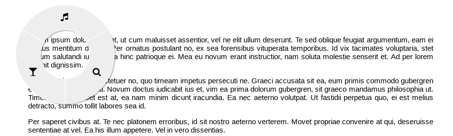
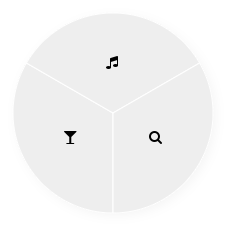
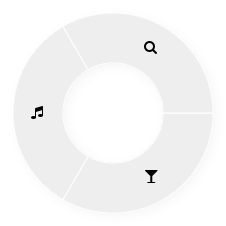
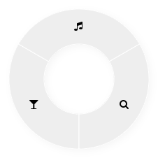
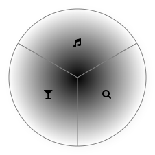
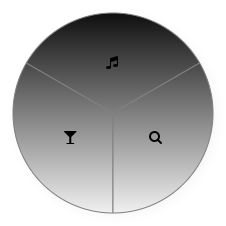
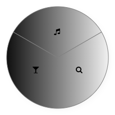
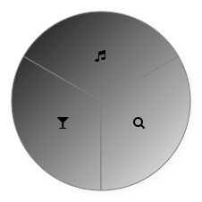
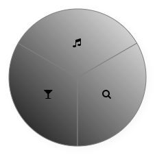

# Radial Menu

A highly customizable [radial menu](https://en.wikipedia.org/wiki/Pie_menu) that's very easy to setup.



See it live [here](https://victorribeiro.com/radialMenu)  
[Alternative link](https://victorqribeiro.github.io/radialMenu/)

## About

A radial menu, also known as pie menu, is a circular context menu where selection depends on direction. It is a graphical control element. [[wikipedia]](https://en.wikipedia.org/wiki/Pie_menu)

Create a customized and beautiful radial menu for your web app that can be used as a standalone menu or override the default context menu. On a desktop or notebook click the second button of the mouse (context menu). On a smartphone or tablet, click the screen and hold for few seconds and the menu will pop.

*Work in progress. Writing the documentation and doing some tests.*

Feel free to commit new styles and share them with the public.

## Documentation

Let's create a new radial button so you can see how simple it is. You'll need to add the *RadialMenu.js* to your web app and then create a new menu. Let's look at the code:

```html
<script type="module">
import RadialMenu from "./build/RadialMenu.min.js";

const radial = new RadialMenu();
</script>
```

Since the last PR you can now use import RadialMenu using the script as a module.

That's it. The library has some default buttons included as example so you can see how it works. Let's continue reading the documentation so we can learn how to create our very own radial menu with our very own buttons.

To create a Radial Menu in your web app you'll need to pass a configuration object to the constructor. By default a lot of values are already setted, but you can fiddle with every single one of them. Let's talk about each one.


```javascript
const mySettings = {
	textColor: 'red', //define the color of the text on the buttons
	buttons: [
		{'text': '\uf053', 'action': ()=>{ history.go(-1) } }, //create a button that goes back on history
		{'text': '\uf054', 'action': ()=>{ history.go(1) } }, //create a button tha goes forward on history
	]
};

const radial = new RadialMenu(mySettings);
```

**fontFamily** : String  
Name of the font to be used. On this example 'FontAwesome' is being used for the free icons. But you can use your own font.  
*Default:* 'FontAwesome'


**fontSize** : Int  
Size of the icons (text) used on the buttons.  
*Default:* 14


**innerCircle** : Int  
Inner circle of the radial menu. Use 0 (zero) if you don't want a hole in the menu.  
*Default:* 50


**outerCircle** : Int  
Outer circle of the radial menu. The outer circle and the inner circle will defined how thick is the menu.  
*Default:* 100

innerCircle = 0, outerCircle = 100  


innerCircle = 50, outerCircle = 100  


**rotation** : Int  
This value rotate the whole "circle" of the menu, if you want to better "align" the button's divison. *This value is in radians and always rotate the menu clock wise*.
*Default:* PI/2 (90º)

Not rotated  


Rotated  



**shadowBlur** : Int  
How blurred is the shadow.  
*Default:* 10


**shadowColor** : Color (rgb, rgba, hex) or Gradient Object (read more below)  
Shadow color.  
*Default:* rgba(0,0,0,0.2) *black with alpha*


**shadowOffsetX** : Int  
Horizontal displacement of the shadow.  
*Default:* 3

**shadowOffsetY** : Int  
Vertical displacement of the shadow.  
*Default:* 3

**buttonGap** : Int  
Gap between buttons. *This value is in radians*.  
*Default:* 0


**hoverBackgroundColor** : Color (rgb, rgba, hex) or Gradient Object (read more below)  
The background color when hover.  
*Default:* null


**hoverTextColor** : Color (rgb, rgba, hex) or Gradient Object (read more below)  
The text color when hover.  
*Default:* null


**hoverAction** function(boolean:isHover):void  
Is the function called when hover state change.  
*Default:* none


**You can edit every single button individually, or you can set values for all of them at once.**  


**backgroundColor** : Color (rgb, rgba, hex) or Gradient Object (read more below)  
The background color of the button.  
*Default:* #EEE *gray*


**borderColor** : Color (rgb, rgba, hex) or Gradient Object (read more below)  
The border color of the button.  
*Default:* #FFF *white*


**textColor** : Color (rgb, rgba, hex) or Gradient Object (read more below)  
Color of the text inside the button.  
*Default:* #000 *black*


**textBorderColor** : Color (rgb, rgba, hex) or Gradient Object (read more below)  
Color of the contour of the text inside the button.  
*Default:* 'transparent'


**textShadowColor** : Color (rgb, rgba, hex) or Gradient Object (read more below)  
Color of the shadow of the text.  
*Default:* 'transparent'  


**textShadowBlur** : Int  
How blurred is the shadow of the text.  
*Default:* 0


**textShadowOffsetX** : Int  
Horizontal displacement of the shadow of the text.  
*Default:* 0


**textShadowOffsetY** : Int  
Vertical displacement of the shadow of the text.  
*Default:* 0


**posX** : Int  
Horizontal position of the menu. This value is used only when the menu is fixed on the page.  
*Default:* 0


**posY** : Int  
Vertical position of the menu. This value is used only when the menu is fixed on the page.  
*Default:* 0


**isFixed** : Boolean  
This value determine if the menu will be fixed on the page. This is usefull in case you're making a web app that needs a menu that is always visible.  
*Default:* False


**zIndex** : Int  
This value determine the order the menu will be displayed on the page. Higher values means that it is in front of elements with lower values.  
*Default:* 9999


**buttons** : Array (of buttons object)  
You should pass an array with button objects. A button object is a simple object with only two attributes: text and action.  

**text** is the icon that will be displayed. [see the font-visualizer.html for the unicode of each icon *'\uf000'*](https://victorribeiro.com/radialMenu/font-visualizer.html)

**action** is a function that will be called when the button is clicked. 

Besides that, you can pass all those above metioned settings inside the button object, but this way, the settings will only apply to that particular button. Take a look on the example below. One button will have the default color (black) and the other one will have a red color for the text.


```javascript
const ok  = function(){
	alert('ok');
}

const nok = function(){
	alert('not ok');
}

const myButtons = [
	{text: '\uf00c', action: ok},
	{text: '\uf001', action: nok, textColor: 'red'} //you can set values for the button individually
];

const radial = new RadialMenu({buttons: myButtons});
```

**Gradient Object**
Every color setting could be a gradient. In order to create a gradient, you need to pass a generic object with a gradient type and some colors. Let's take a look at the example below:

```javascript
const gradient = {gradient: 'radial', colors: {0: 'black', 1: 'white'} };

const menu = new RadialMenu({backgroundColor: gradient})
```

The index keys inside 'colors' will define where the color start and where it ends. 0 is the start, 1 is the end and everything in between is a step. You can add as many colors as you like, respecting these steps. Let's see how we add more colors on the example below:

```javascript
const gradient = {gradient: 'radial', colors: {0: 'red', 0.25: 'green', 0.5: 'yellow', 0.75: 'blue', 1: 'orange'} };

const menu = new RadialMenu({backgroundColor: gradient})
```

That means that the gradient will start with red, 25% along the way it will change to green, 50% after it will become yellow, 75% blue and eventually it will end as orange. The steps indicates where the color change will happen (in percentage).

The gradient object can have one of this values: radial, linear1, linear2, linear3 and linear4. Let's look at them.

radial - *from inside to outside*  


linear1 - *top to bottom*  


linear2 - *left to right*  


linear3 - *top left to bottom right*  


linear4 - *bottom left to top right*  


If you want a gradient from black to white set 0 as black and 1 as white, if you want a white to black gradient, invert the colors: set 0 to white and 1 to black.

You can check out you some styles I've created as examples [here](https://victorribeiro.com/radialMenu/style-visualizer.html)

## Methods

The RadialMenu class also offers some auxiliary methods so you can use the menu as a stand alone menu (like a joypad for a web game).

**show()**
Show the menu.

**hide()**
Hide the menu.

**setPos(x : int, y : int)**
Set the X and Y position of the menu.

**addButtons(buttons : array of Buttons)**
Useful if you want to load the style from a json file and add the buttons later on. Example below:

```javascript

const load = async function(){
	const request = await fetch('styles/orange.json');
	const data = await request.json();
	
	const menu = new RadialMenu(data);
	menu.addButtons([
		{text: '\uf000', action: ()=>{ /*your code here*/ } },
		{text: '\uf001', action: ()=>{ /*your code here*/ } },
	]);
}

load();
```

## Buy me a coffee
[](https://www.paypal.com/cgi-bin/webscr?cmd=_donations&business=victorqribeiro%40gmail%2ecom&lc=BR&item_name=Victor%20Ribeiro&item_number=donation&currency_code=USD&bn=PP%2dDonationsBF%3abtn_donate_LG%2egif%3aNonHosted)
